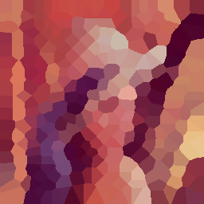
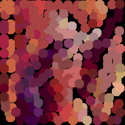

# pixelnodes

 This package converts an image into Graph-Representation.
You can check the graph using superpixel or node representation.

## Installation

python = ">=3.10, <3.11"

```bash

poetry add git+https://github.com/kevin-tofu/pixelnodes.git

```

## Example




```python

import pixelnodes
from skimage.transform import resize
from skimage.util import img_as_ubyte

image = skimage.io.imread('./lena.png')
image_resize = img_as_ubyte(resize(image, (256, 256)))
skimage.io.imsave('./lena-resize.png', image_resize)


# nodes = clustering(image, 0.01, 2000, weight_pixelvalue=10)
nodes = pixelnodes.clustering(image_resize, 0.01, 200, weight_pixelvalue=0.2)
image_superpixel = pixelnodes.create_superpixel_image(nodes)
image_nodes = pixelnodes.create_nodes_image(nodes)

skimage.io.imsave('./lena-superpixel.png', image_superpixel)
skimage.io.imsave('./lena-nodes.png', image_nodes)

```

### The definition of node format is below

```python

class Nodes(NamedTuple):
    labels: list[int]
    centres: list[list[float]]
    members_size: list[int]
    weight_pixelvalue: float
    image_shape: tuple
    pixelset_shape: tuple

```
